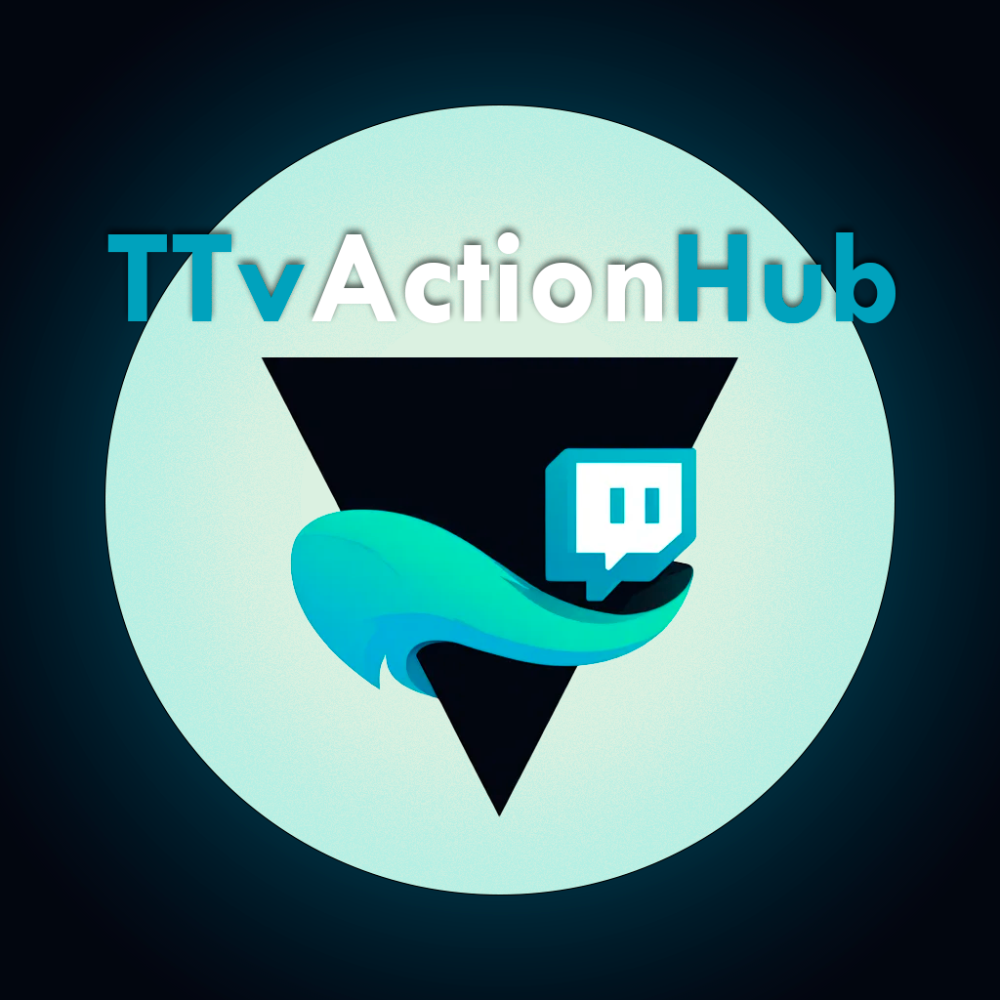

    <table>
    <tr>
        <td>
            
        </td>
        <td>
            <h2>TTvActionHub</h2>
        </td>
    </tr>
  </table>

> This project consolidates essential Twitch streaming tools into one platform, including music playback, keyboard and mouse emulation, and data storage. All features are activated via Twitch channel points or commands using a personalized chat bot.

## Features

- **Sound playback**
- **Data storage under names**
- **Custom events for Twitch chat commands**
- **Custom events for Twitch channel points**
- **Keyboard emulation**
- **Mouse emulation**

## Highlights

- **[LUA Scripting](#lua-scripting)**: Since the project focuses on complete freedom, we provide possibilities and tools, and the user determines what and how it should work. That's why the most user-friendly interface was chosen for this approach.

## Installation (Windows)

1. Ensure you have Windows with .NET 8 installed. [You can download .NET 8 here if needed](https://dotnet.microsoft.com/en-us/download).
2. Download the latest release from the [Releases](https://github.com/MrRoxandi/TwitchController/releases) page.
3. Extract the archive to a desired location.

## Running (Windows)

1. Navigate to the extracted directory.
2. Place `config.lua` file in root directory. (or just run the program)
3. Run the `TwitchController.exe`.

## LUA Scripting

This project allows you to customize chat commands using LUA scripts. The [`examples`](TTvActionHub/example/) files provides an example files for configuration, commands and other. For a detailed description of the available API, please refer to the [API_ENG](TTvActionHub/API_ENG.md)/[API_RU](TTvActionHub/API_RU.md) .

## License

This project is licensed under the [MIT License](LICENSE.txt).
